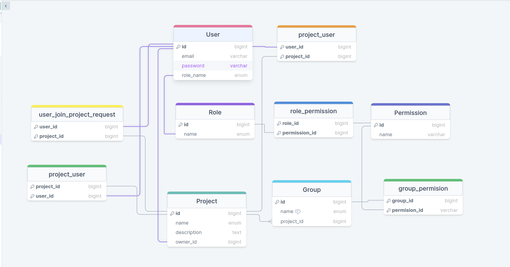

'''

# Проект RESTful API - Благовест Недков

## Описание проекта

Проект RESTFull API, разработанный на Python 3.10.

## Инфраструктура

- PostgreSQL версии 15
- Redis версии 6

## Контейнеризация и развертывание

Проект контейнеризован с использованием Docker и оркестрован при помощи Docker Compose.

## Управление зависимостями

Для управления зависимостями используется менеджер пакетов Poetry.

## Основные зависимости проекта

- asyncpg
- SQLAlchemy
- aioredis
- pydantic
- pydantic-settings
- FastAPI
- uvicorn

## Архитектура проекта

Проект построен в соответствии с принципами чистой архитектуры.

## Запуск приложения

1. Установите Python 3.10, Docker и Docker Compose, а также Poetry.
2. Запустите приложение с помощью команды:
   ```docker-compose -f docker-compose.yml up -d```
3. Установите настройку Poetry для использования виртуального окружения в проекте:
   ```poetry config virtualenvs.in-project true```
4. Активируйте виртуальное окружение:
   ```poetry shell```
5. Установите зависимости проекта:
   ```poetry install```
6. Запустите приложение:
   ```app/run.py```
7. Перейдите по адресу:
[http://localhost:8000/](http://localhost:8000/)

## Схема база данных
[https://drawsql.app/teams/bg-ru/diagrams/restapi](https://drawsql.app/teams/bg-ru/diagrams/restapi)



## Реализован функционал

- Создан конфигурационный файл для настройки приложения.
- При добавлении новой модели (таблицы) должна происходить автоматическая
  генерация имени права для этой таблицы в таблице Permission.
- Реализована функция управления жизненным циклом приложения (lifespan),
  которая поднимает базу данных, создает таблицы и добавляет базовые права.
- Настроен логгер для записи логов в консоль и файл. Файл ограничен по размеру до 30 МБ и
  ротируется.
- Реализована регистрация пользователей с шифрованием пароля.
- Реализована аутентификация (логин) с выдачей токена.
- Реализован эндпоинт для обновления токенов(refresh_token).
- Реализована авторизация конечных точек по токенам и ролям пользователя.
- Реализован кеш токенов для ограничения запросов к PostgreSQL.
- Реализована конечная точка для добавления новых проектов с автоматическим добавлением группы
  проекта и прав групп.

## Что можно улучшит

- В будущем понадобится инструмент Alembic для управления миграциями (на данный момент он не
  требуется).
- Можно и нужно написание юнит-тестов (для мелких функции) и интеграционных тестов для эндпоинтов.
- Можно и нужно добавить метрики, но для этого потребуется дополнительная инфраструктура
  например(Prometheus и Grafana), а это время.

## П.С. Не успел написать все эндпоинты, не хватило времени.
'''
